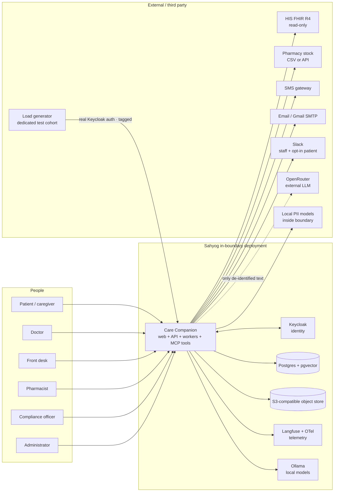

# 2.1 Context diagram

Source: [architecture.md](../architecture.md)

```mermaid
flowchart LR
  subgraph People["People"]
    P[Patient / caregiver]
    D[Doctor]
    F[Front desk]
    PH[Pharmacist]
    C[Compliance officer]
    A[Administrator]
  end

  subgraph Boundary["Sahyog in-boundary deployment"]
    CC[Care Companion<br/>web + API + workers + MCP tools]
    KC[Keycloak<br/>identity]
    PG[(Postgres + pgvector)]
    OBJ[(S3-compatible object store)]
    LF[Langfuse + OTel<br/>telemetry]
    OLL[Ollama<br/>local models]
  end

  subgraph External["External / third party"]
    HIS[HIS FHIR R4<br/>read-only]
    STK[Pharmacy stock<br/>CSV or API]
    SMS[SMS gateway]
    MAIL[Email / Gmail SMTP]
    SLK[Slack<br/>staff + opt-in patient]
    LG[Load generator<br/>dedicated test cohort]
    OR[OpenRouter<br/>external LLM]
    PII[Local PII models<br/>inside boundary]
  end

  P --> CC
  D --> CC
  F --> CC
  PH --> CC
  C --> CC
  A --> CC
  LG -->|real Keycloak auth · tagged| CC
  CC <--> KC
  CC --> PG
  CC --> OBJ
  CC --> LF
  CC --> OLL
  CC --> HIS
  CC --> STK
  CC --> SMS
  CC --> MAIL
  CC --> SLK
  CC -. only de-identified text .-> OR
  CC --> PII
```
