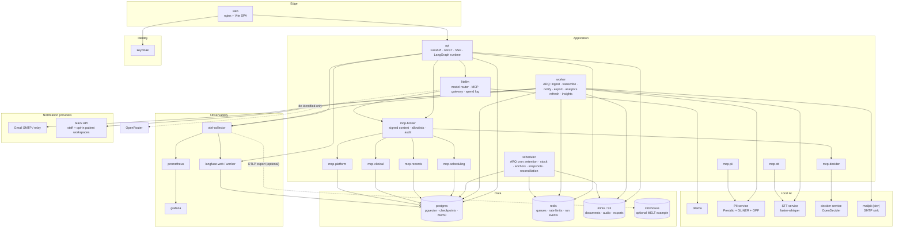

# 3.1 Container diagram

Source: [architecture.md](../architecture.md)

```mermaid
flowchart TB
  subgraph Edge["Edge"]
    WEB["web<br/>nginx + Vite SPA"]
  end

  subgraph App["Application"]
    API["api<br/>FastAPI · REST · SSE · LangGraph runtime"]
    WORKER["worker<br/>ARQ: ingest · transcribe · notify · export · analytics refresh · insights"]
    SCHED["scheduler<br/>ARQ cron: retention · stock · anchors · snapshots · reconciliation"]
    BROKER["mcp-broker<br/>signed context · allowlists · audit"]
    MCP1["mcp-scheduling"]
    MCP2["mcp-records"]
    MCP3["mcp-clinical"]
    MCP4["mcp-platform"]
    MCP5["mcp-decider"]
    MCP6["mcp-pii"]
    MCP7["mcp-stt"]
    LL["litellm<br/>model router · MCP gateway · spend log"]
  end

  subgraph Data["Data"]
    PG[("postgres<br/>pgvector · checkpoints · mem0")]
    RD[("redis<br/>queues · rate limits · run events")]
    S3[("minio / S3<br/>documents · audio · exports")]
    CH[("clickhouse<br/>optional MELT example")]
  end

  subgraph Identity["Identity"]
    KC["keycloak"]
  end

  subgraph Observability["Observability"]
    OTEL["otel-collector"]
    LF["langfuse-web / worker"]
    PROM["prometheus"]
    GRAF["grafana"]
  end

  subgraph LocalAI["Local AI"]
    OLL["ollama"]
    PII["PII service<br/>Presidio + GLiNER + OPF"]
    STT["STT service<br/>faster-whisper"]
    DEC["decider service<br/>OpenDecider"]
    MAIL["mailpit (dev)<br/>SMTP sink"]
  end

  subgraph Notify["Notification providers"]
    SMTP["Gmail SMTP / relay"]
    SLK["Slack API<br/>staff + opt-in patient workspaces"]
  end

  WEB --> API
  WEB --> KC
  API --> PG
  API --> RD
  API --> S3
  API --> BROKER
  API --> LL
  API --> OTEL
  API --> LF
  WORKER --> PG
  WORKER --> RD
  WORKER --> S3
  WORKER --> PII
  WORKER --> STT
  WORKER --> MAIL
  WORKER --> SMTP
  WORKER --> SLK
  WORKER --> OTEL
  SCHED --> PG
  SCHED --> RD
  SCHED --> S3
  BROKER --> MCP1
  BROKER --> MCP2
  BROKER --> MCP3
  BROKER --> MCP4
  BROKER --> MCP5
  MCP1 --> PG
  MCP2 --> PG
  MCP3 --> PG
  MCP4 --> PG
  MCP5 --> DEC
  MCP6 --> PII
  MCP7 --> STT
  LL --> OLL
  LL -. de-identified only .-> OR[OpenRouter]
  LL --> BROKER
  LF --> PG
  OTEL --> LF
  OTEL --> PROM
  OTEL -. OTLP export (optional) .-> CH
  PROM --> GRAF
```
