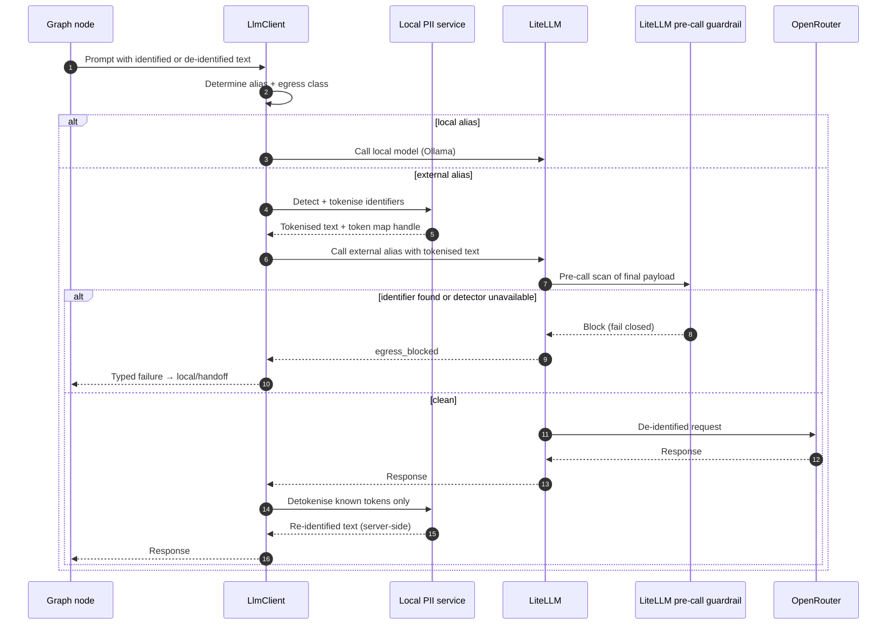

# 5.7 External egress path (PII)

Source: [architecture.md](../architecture.md)

```mermaid
sequenceDiagram
  autonumber
  participant Node as Graph node
  participant LLM as LlmClient
  participant PII as Local PII service
  participant LL as LiteLLM
  participant Hook as LiteLLM pre-call guardrail
  participant OR as OpenRouter

  Node->>LLM: Prompt with identified or de-identified text
  LLM->>LLM: Determine alias + egress class
  alt local alias
    LLM->>LL: Call local model (Ollama)
  else external alias
    LLM->>PII: Detect + tokenise identifiers
    PII-->>LLM: Tokenised text + token map handle
    LLM->>LL: Call external alias with tokenised text
    LL->>Hook: Pre-call scan of final payload
    alt identifier found or detector unavailable
      Hook-->>LL: Block (fail closed)
      LL-->>LLM: egress_blocked
      LLM-->>Node: Typed failure → local/handoff
    else clean
      LL->>OR: De-identified request
      OR-->>LL: Response
      LL-->>LLM: Response
      LLM->>PII: Detokenise known tokens only
      PII-->>LLM: Re-identified text (server-side)
      LLM-->>Node: Response
    end
  end
```
