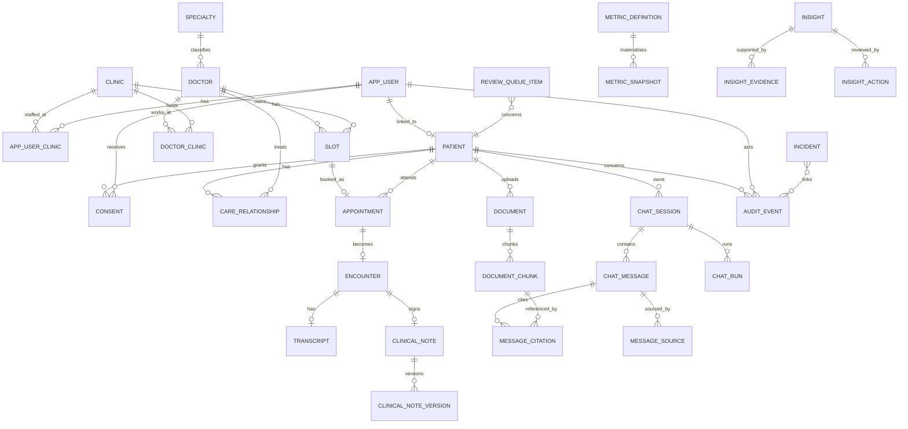

# 6.2 Core entity relationship diagram

Source: [architecture.md](../architecture.md)

```mermaid
erDiagram
  CLINIC ||--o{ APP_USER_CLINIC : staffed_at
  APP_USER ||--o{ APP_USER_CLINIC : has
  APP_USER ||--o| PATIENT : linked_to
  PATIENT ||--o{ CONSENT : grants
  APP_USER ||--o{ CONSENT : receives
  PATIENT ||--o{ CARE_RELATIONSHIP : has
  DOCTOR ||--o{ CARE_RELATIONSHIP : treats
  DOCTOR ||--o{ DOCTOR_CLINIC : works_at
  CLINIC ||--o{ DOCTOR_CLINIC : hosts
  SPECIALTY ||--o{ DOCTOR : classifies
  DOCTOR ||--o{ SLOT : has
  CLINIC ||--o{ SLOT : owns
  SLOT ||--o| APPOINTMENT : booked_as
  PATIENT ||--o{ APPOINTMENT : attends
  APPOINTMENT ||--o| ENCOUNTER : becomes
  ENCOUNTER ||--o| TRANSCRIPT : has
  ENCOUNTER ||--o| CLINICAL_NOTE : signs
  CLINICAL_NOTE ||--o{ CLINICAL_NOTE_VERSION : versions
  PATIENT ||--o{ DOCUMENT : uploads
  DOCUMENT ||--o{ DOCUMENT_CHUNK : chunks
  PATIENT ||--o{ CHAT_SESSION : owns
  CHAT_SESSION ||--o{ CHAT_MESSAGE : contains
  CHAT_MESSAGE ||--o{ MESSAGE_CITATION : cites
  CHAT_MESSAGE ||--o{ MESSAGE_SOURCE : sourced_by
  DOCUMENT_CHUNK ||--o{ MESSAGE_CITATION : referenced_by
  PATIENT ||--o{ AUDIT_EVENT : concerns
  APP_USER ||--o{ AUDIT_EVENT : acts
  CHAT_SESSION ||--o{ CHAT_RUN : runs
  REVIEW_QUEUE_ITEM }o--|| PATIENT : concerns
  INCIDENT }o--o{ AUDIT_EVENT : links
  METRIC_DEFINITION ||--o{ METRIC_SNAPSHOT : materialises
  INSIGHT ||--o{ INSIGHT_EVIDENCE : supported_by
  INSIGHT ||--o{ INSIGHT_ACTION : reviewed_by
```
