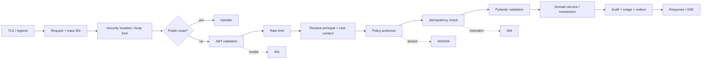

# 7.3 Request pipeline

Source: [architecture.md](../architecture.md)

```mermaid
flowchart LR
  A[TLS / ingress] --> B[Request + trace IDs]
  B --> C[Security headers / body limit]
  C --> D{Public route?}
  D -->|yes| E[Handler]
  D -->|no| F[JWT validation]
  F --> G[Rate limit]
  G --> H[Resolve principal + care context]
  H --> I[Policy authorize]
  I --> J[Idempotency check]
  J --> K[Pydantic validation]
  K --> L[Domain service / transaction]
  L --> M[Audit + usage + outbox]
  M --> N[Response / SSE]
  F -. invalid .-> X[401]
  I -. denied .-> Y[403/404]
  J -. mismatch .-> Z[409]
```
