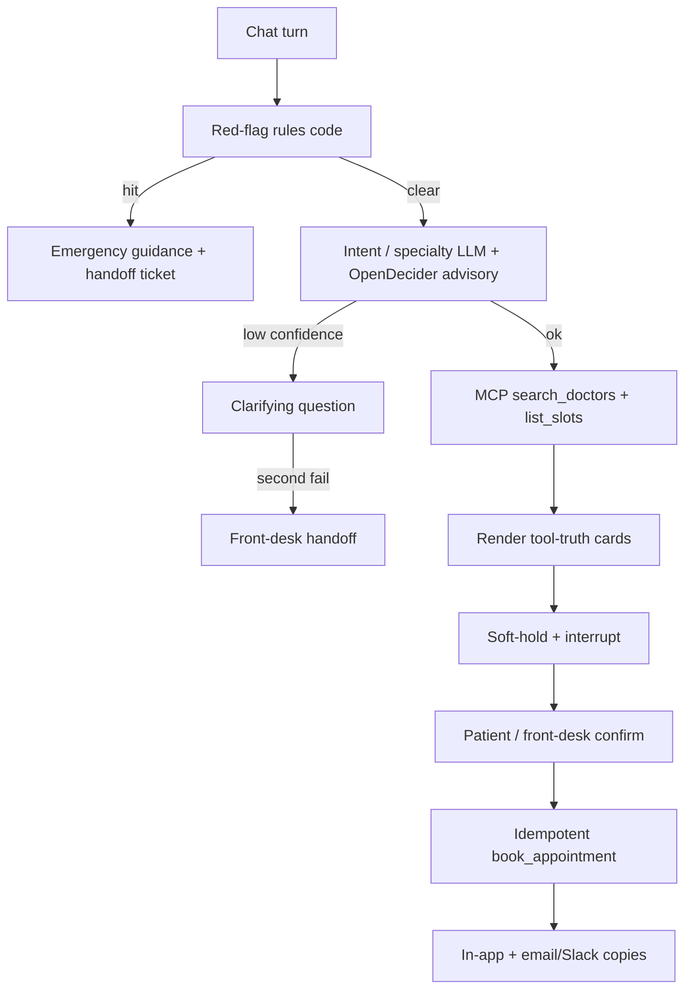

# W1 triage and booking graph

Source: [architecture.md §8.5](../architecture.md) · [design.md](../design.md)

```mermaid
flowchart TD
  start[Chat turn] --> rf[Red-flag rules code]
  rf -->|hit| emerg[Emergency guidance + handoff ticket]
  rf -->|clear| intent[Intent / specialty LLM + OpenDecider advisory]
  intent -->|low confidence| clarify[Clarifying question]
  clarify -->|second fail| desk[Front-desk handoff]
  intent -->|ok| tools[MCP search_doctors + list_slots]
  tools --> cards[Render tool-truth cards]
  cards --> hold[Soft-hold + interrupt]
  hold --> confirm[Patient / front-desk confirm]
  confirm --> book[Idempotent book_appointment]
  book --> notify[In-app + email/Slack copies]
```
