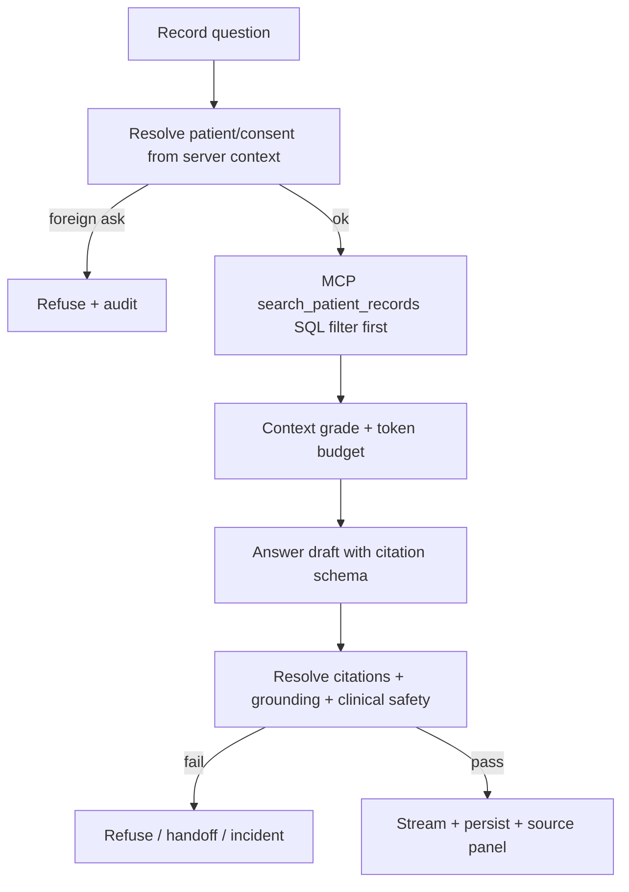

# W2 ask-my-record graph

Source: [architecture.md §8.6](../architecture.md)

```mermaid
flowchart TD
  q[Record question] --> scope[Resolve patient/consent from server context]
  scope -->|foreign ask| refuse[Refuse + audit]
  scope -->|ok| retrieve[MCP search_patient_records SQL filter first]
  retrieve --> grade[Context grade + token budget]
  grade --> draft[Answer draft with citation schema]
  draft --> validate[Resolve citations + grounding + clinical safety]
  validate -->|fail| refuse2[Refuse / handoff / incident]
  validate -->|pass| emit[Stream + persist + source panel]
```
