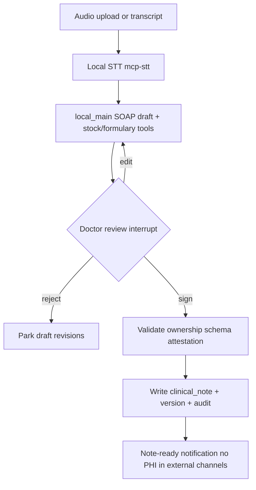

# W3 scribe and signature graph

Source: [architecture.md §8.7](../architecture.md)

```mermaid
flowchart TD
  audio[Audio upload or transcript] --> stt[Local STT mcp-stt]
  stt --> draft[local_main SOAP draft + stock/formulary tools]
  draft --> review{Doctor review interrupt}
  review -->|edit| draft
  review -->|reject| park[Park draft revisions]
  review -->|sign| gate[Validate ownership schema attestation]
  gate --> note[Write clinical_note + version + audit]
  note --> notify[Note-ready notification no PHI in external channels]
```
